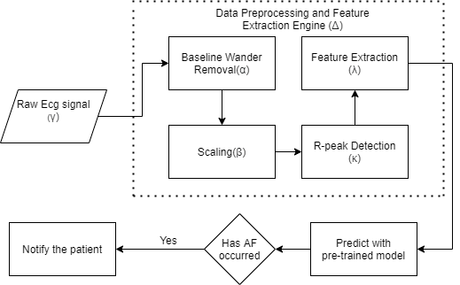

# End-to-End Optimized Arrhythmia Detection Pipeline using Machine Learning for Ultra-Edge Devices

## Description

This repository contains code for the implementation of the paper titled "End-to-End Optimized Arrhythmia Detection Pipeline using Machine Learning for Ultra-Edge Devices", that has been **accepted** at the [20<sup>th</sup> IEEE International Conference on Machine Learning and Applications (ICMLA21), Pasadena, CA, USA](https://www.icmla-conference.org/icmla21/). You can download all three datasets from [PhysioNet](https://physionet.org/about/database/).

1. [MIT-BIH Atrial Fibrillation DataBase (AFDB)](https://physionet.org/content/afdb/1.0.0/)
2. [CHALLENGE 2017 DATABASE (2017/CHDB)](https://archive.physionet.org/physiobank/database/challenge/2017/)
3. [MIT-BIH Malignant Ventricular Ectopy Database (VFDB)](https://physionet.org/content/vfdb/1.0.0/)

## Architecture

<p>
    
</p>

## Publication Link

Link: https://arxiv.org/abs/2111.11789

Citation:
```
@misc{b2021endtoend,
      title={End-to-End Optimized Arrhythmia Detection Pipeline using Machine Learning for Ultra-Edge Devices}, 
      author={Sideshwar J B and Sachin Krishan T and Vishal Nagarajan and Shanthakumar S and Vineeth Vijayaraghavan},
      year={2021},
      eprint={2111.11789},
      archivePrefix={arXiv},
      primaryClass={cs.LG}
}
```
